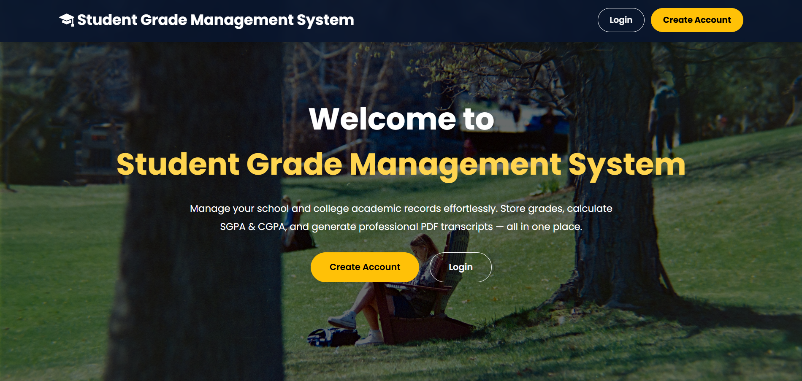
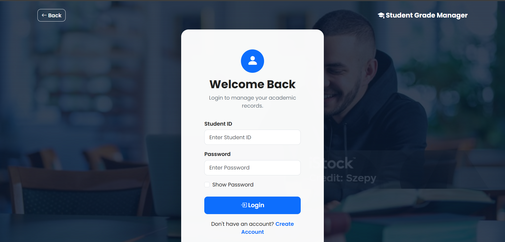
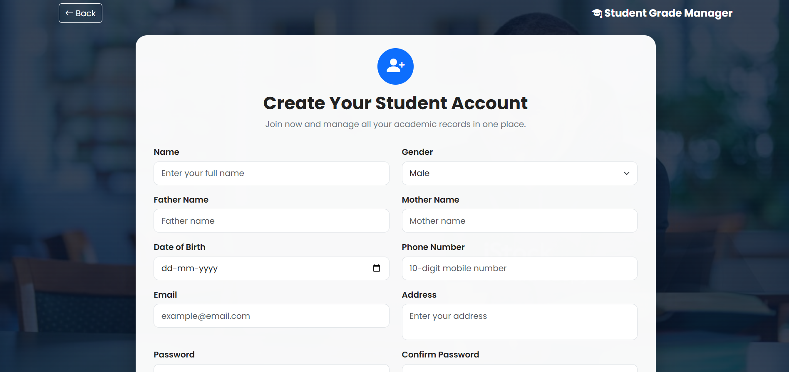
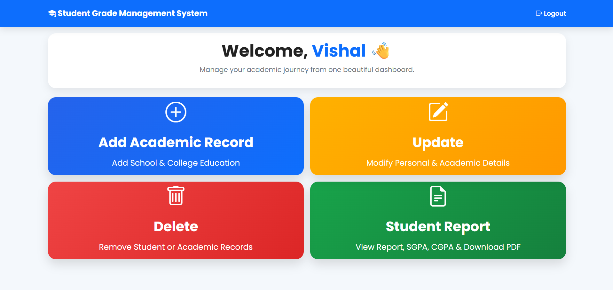
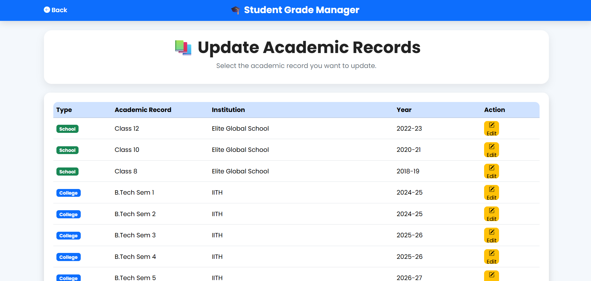
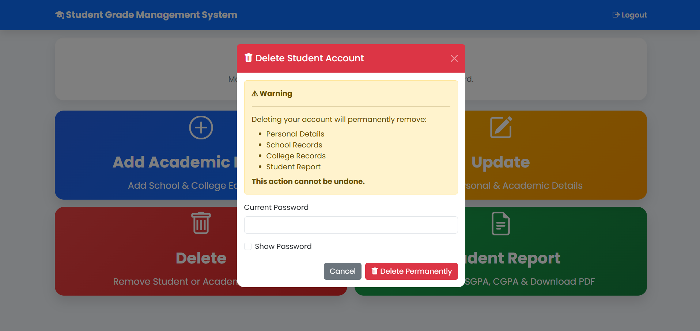

<div align="center">

# 🎓 Student Grade Management System (Web)

## A Full-Stack Flask Web Application for Managing Student Academic Records

A modern web-based student management system that enables students to securely manage their personal information, school and college academic records, calculate SGPA/CGPA, and generate professional PDF transcripts.

---
[](YOUR_RENDER_URL)


</div>

---

## 📖 Overview

Student Grade Management System is a **Flask-based web application** designed to simplify the management of academic records. It provides a clean and user-friendly interface for storing, updating, and managing student information while automatically calculating academic performance metrics such as **SGPA** and **CGPA**.

The application integrates **Python, Flask, MySQL, HTML, CSS, Bootstrap, and JavaScript** to create a responsive web platform with secure authentication and complete CRUD functionality.

Unlike traditional command-line implementations, this version offers an interactive dashboard, modern forms, validation, report generation, and downloadable PDF transcripts.

---

## ✨ Key Features

### 👤 Student Account Management

- Create a secure student account
- Student login authentication
- Password protection
- Session management
- Update personal profile
- Delete account with confirmation

---

### 🎓 Academic Record Management

- Add School Academic Records
- Add College Academic Records
- Update existing academic records
- Delete academic records
- Automatic validation
- Duplicate subject prevention

---

### 📊 Performance Analysis

- Automatic SGPA calculation
- Automatic CGPA calculation
- Semester-wise transcript
- Degree-wise report
- Organized academic history

---

### 📄 Report Generation

- Professional Student Report
- PDF Transcript Generation
- Personal Information Summary
- School Education Summary
- College Semester Summary

---

### 🎨 Modern User Interface

- Responsive Bootstrap design
- Dashboard-based navigation
- Professional landing page
- Interactive cards
- Validation messages
- Password visibility toggle
- Clean and intuitive layout

---

### 🔒 Security Features

- Login authentication
- Password verification before deletion
- Input validation
- Protected dashboard
- Session-based authentication

---

## 🛠️ Technology Stack

| Category              | Technologies                         |
|-----------------------|--------------------------------------|
| Backend               | Python, Flask                        |
| Frontend              | HTML5, CSS3, Bootstrap 5, JavaScript |
| Database              | MySQL                                |
| PDF Generation        | ReportLab                            |
| Database Connectivity | mysql-connector-python               |
| Version Control       | Git & GitHub                         |

---

## 📸 Application Screenshots

### 🏠 Home Page

The landing page introduces the application and provides quick access to login and account creation.



---

### 🔑 Login Page

Secure login interface for authenticated student access.



---

### 👤 Create Account

Registration page for creating a new student account with validation.



---

### 📋 Dashboard

Central dashboard providing access to all academic management features.



---

### ✏️ Update Academic Records

Manage and modify existing school and college academic records.



---

### 🗑️ Delete Student Account

Confirmation dialog with password verification before permanent account deletion.



---

## 📂 Project Structure

```text
student-grade-management-system-web/
│
├── app.py                     # Flask application entry point
├── main.py                    # Core application logic
├── database.py                # MySQL database connection
├── person.py                  # Person class
├── student.py                 # Student class
├── academic_manager.py        # Academic record management
├── grade_manager.py           # Grade calculation logic
├── pdf_generator.py           # PDF transcript generation
├── requirements.txt           # Project dependencies
├── LICENSE
├── README.md
│
├── routes/
│   └── auth.py                # Application routes
│
├── templates/                 # HTML templates
│   ├── home.html
│   ├── login.html
│   ├── dashboard.html
│   ├── create_account.html
│   ├── school_record.html
│   ├── college_record.html
│   ├── update_personal.html
│   ├── update_academic.html
│   ├── delete_academic.html
│   ├── student_report.html
│   └── ...
│
├── static/
│   ├── style.css
│   └── images/
│
├── images/                    # README screenshots
│
└── sql/
    └── schema.sql             # Database schema
```

---

## ⚙️ Installation

### 1️⃣ Clone the Repository

```bash
git clone https://github.com/Vishal-gujjar/student-grade-management-system-web.git
```

```bash
cd student-grade-management-system-web
```

---

### 2️⃣ Create a Virtual Environment (Recommended)

#### Windows

```bash
python -m venv venv
```

Activate the environment:

```bash
venv\Scripts\activate
```

#### Linux / macOS

```bash
python3 -m venv venv
```

Activate:

```bash
source venv/bin/activate
```

---

### 3️⃣ Install Required Packages

```bash
pip install -r requirements.txt
```

---

## 🗄️ Database Setup

### Step 1

Install **MySQL Server**.

---

### Step 2

Create a new database.

Example:

```sql
CREATE DATABASE student_grade_management;
```

---

### Step 3

Import the database schema.

```sql
SOURCE sql/schema.sql;
```

or import it using **MySQL Workbench**.

---

### Step 4

Open **database.py** and configure your database credentials.

```python
host = "localhost"
user = "root"
password = "YOUR_PASSWORD"
database = "student_grade_management"
```

Replace the values with your own MySQL configuration.

---

## ▶️ Running the Application

Start the Flask server.

```bash
python app.py
```

If everything is configured correctly, the application will start successfully.

Open your browser and visit:

```text
http://127.0.0.1:5000
```

---

## 🔄 Application Workflow

```text
Create Account
        │
        ▼
Login
        │
        ▼
Dashboard
        │
 ┌──────┼──────────────┐
 │      │              │
 ▼      ▼              ▼
School  College    Update Profile
Record  Record
 │        │
 └────┬───┘
      ▼
Student Report
      │
      ▼
Generate PDF
```

---

## 🚀 Future Improvements

Some features that can be added in future versions include:

- Email Verification
- Password Reset via Email
- Admin Dashboard
- Student Profile Photo Upload
- GPA Performance Charts
- Advanced Search & Filters
- Export Reports to Excel
- Multi-user Roles (Admin, Faculty, Student)
- REST API Integration
- Docker Deployment
- Cloud Database Support
- Unit & Integration Testing

---

## 📚 Learning Outcomes

This project helped strengthen my understanding of:

- Object-Oriented Programming (OOP)
- Flask Web Development
- RESTful Routing
- CRUD Operations
- MySQL Database Design
- HTML, CSS, Bootstrap
- Session Management
- Form Validation
- PDF Generation
- Git & GitHub
- Software Project Organization

---

## 👨‍💻 Author

### Vishal

B.Tech in Engineering Physics  
Indian Institute of Technology Hyderabad (IITH)

### GitHub

[](https://github.com/Vishal-gujjar)

---

<div align="center">

### Thank you for visiting this repository

### Happy Coding! 🚀

</div>
